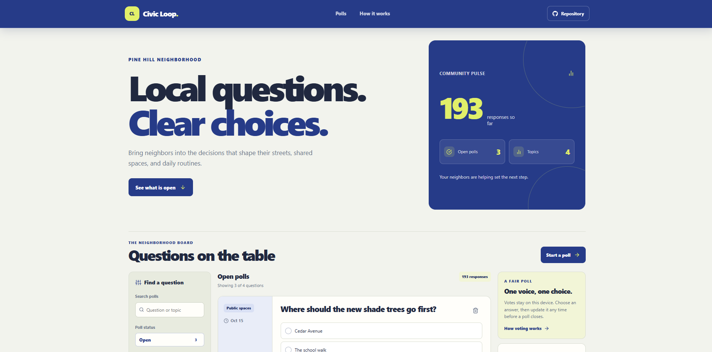



# Civic Loop - Community Poll Builder

Civic Loop is a small, browser-based community polling board. Neighbors can raise a local question, choose from a few answers, vote, and review how the responses are distributed.

**Live site:** [https://a2rp.github.io/community-poll-builder/](https://a2rp.github.io/community-poll-builder/)

## What is included

- A fixed header with links to the poll board and the voting guide, plus a visible link to the public source repository.
- A community summary with the number of open polls, total responses, and topics represented.
- Sample polls about shared spaces, community events, local services, and neighborhood plans.
- Search across poll questions and topic names.
- Open, closed, and all poll filters, plus a topic selector.
- A poll creation dialog with a question, topic, closing date, and two to five answer choices.
- A vote flow that shows response totals and percentages after a vote is cast.
- The ability to change a vote until that poll closes.
- Automatic closure after the selected local date has passed.
- A custom confirmation dialog before deleting a poll and its votes.
- Empty states, keyboard-accessible dialogs, status messages, responsive layouts, and a Back to top button after scrolling more than 50px.
- A footer with the profile links, support links, copyright, and source repository link.

## How to use it

Select **Start a poll**, enter a clear question, choose a topic and closing date, then add two to five answer choices. Select **Publish poll** to add it to the open list.

Choose an answer on an open poll, then select **Cast vote**. The card shows the latest totals and percentages. Select a different answer and choose **Update vote** to change your response before the poll closes.

Use the status controls, topic selector, and search field to narrow the list. Select **Delete poll** on a card and confirm in the dialog to remove that poll and its votes. The dialog identifies the poll and focuses the safe **Keep poll** action first.

## How data is stored

This is a front-end demonstration. The starting polls are sample data in `src/data/polls.js`. Polls and votes are stored in browser `localStorage` under `civic-loop-polls`. They stay in the current browser on the current device and do not sync with other visitors or contact a server. If browser storage is unavailable, changes last only until the page is closed.

The sample response totals are illustrative. A vote adds or moves one response in the current browser. Deleting a poll removes it from that browser's saved list. Clearing the site's browser storage restores the sample polls.

## Run locally

Install a current Node.js version, then run these commands from this project folder:

~~~sh
npm install
npm run dev
~~~

Open the local address printed by Vite.

## Lint, build, and deploy

~~~sh
npm run lint
npm run build
npm run deploy
~~~

The `deploy` command runs the production build first, then publishes the contents of `dist` to the `gh-pages` branch. GitHub Pages serves the app at [https://a2rp.github.io/community-poll-builder/](https://a2rp.github.io/community-poll-builder/). Vite uses `/community-poll-builder/` as its base path. Do not commit the generated `dist` folder to `main`.

## Future improvements

These are ideas for later work and are not implemented:

- Connect a shared database so neighbors can see the same polls and results.
- Add organizer accounts, poll review, and moderation controls.
- Add anonymous voter limits and protection against repeated votes.
- Add live result updates, poll links, and CSV export.
- Add calendar dates, map context, and more question formats.

## Links

- Portfolio: [https://www.ashishranjan.net](https://www.ashishranjan.net)
- GitHub: [https://github.com/a2rp](https://github.com/a2rp)
- CodePen: [https://codepen.io/ash1198](https://codepen.io/ash1198)
- LinkedIn: [https://www.linkedin.com/in/aashishranjan](https://www.linkedin.com/in/aashishranjan)
- Facebook: [https://www.facebook.com/theash.ashish/](https://www.facebook.com/theash.ashish/)
- YouTube: [https://www.youtube.com/@ashishranjan-ashz?sub_confirmation=1](https://www.youtube.com/@ashishranjan-ashz?sub_confirmation=1)
- Email: [mailto:ash.ranjan09@gmail.com](mailto:ash.ranjan09@gmail.com)
- Source code: [https://github.com/a2rp/community-poll-builder](https://github.com/a2rp/community-poll-builder)

## Support

- Support: [https://a2rp-donation-page.netlify.app/](https://a2rp-donation-page.netlify.app/)
- Buy Me a Coffee: [https://buymeacoffee.com/ashishranjan](https://buymeacoffee.com/ashishranjan)
- Patreon: [https://www.patreon.com/ashishranjan](https://www.patreon.com/ashishranjan)

